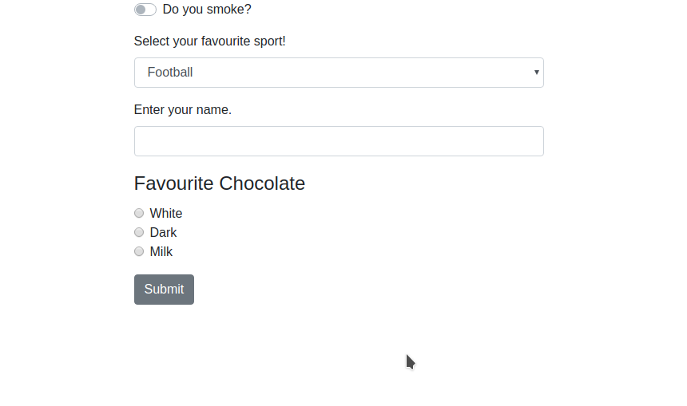

# Dynamic React form

A dynamic form generator which can currently create input fields, radio buttons, switches and dropdown.



```json5

const exampleData = [
    {
        key: 'item1',
        label: 'Do you want to subscribe?',
        type: 'switch',
        data: []
    },
    {
        key: 'item2',
        label: 'Select your favourite sport!',
        type: 'dropdown',
        data: [
            { key: 'subitem1', value: "football", label: "Football"},
            { key: 'subitem2', value: "rugby", label: "Rugby"},
            { key: 'subitem3', value: "swimming", label: "Swimming"},
        ]
    },
    {
        key: 'item3',
        label: 'Enter your name.',
        type: 'input',
    },
    {
        key: 'item4',
        label: 'Favourite Chocolate',
        type: 'radio',
        data: [
            { key: 'subitem1', value: "white", label: "White"},
            { key: 'subitem2', value: "dark", label: "Dark"},
            { key: 'subitem3', value: "milk", label: "Milk"},
        ]
    }
];
```

Create a Form Generator Component and pass in the json to generate a reactstrap form
```
<FormGenerator data={exampleData}/>
```
